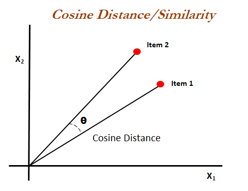
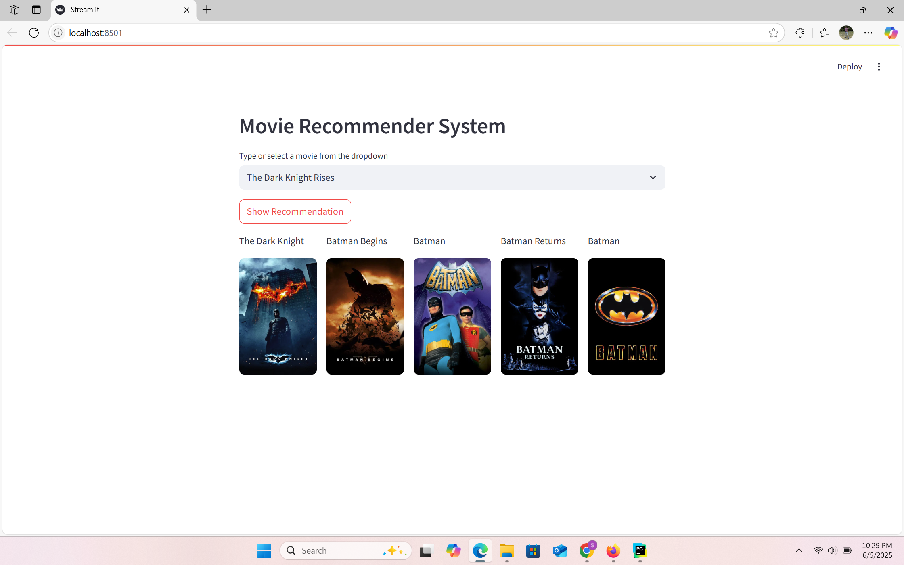

# Content-Based Movie Recommendation System with Sentiment Analysis

### Project Overview
The Movie Recommender System is a machine learning-based application designed to provide personalized movie recommendations to users. Using Natural Language Processing (NLP) techniques and cosine similarity, the system analyzes movie metadata and suggests movies based on user preferences.

### Features

* Content-Based Recommendations: Suggests movies based on similarity of movie descriptions.
* NLP Techniques: Utilizes text analysis for meaningful recommendations.
* Cosine Similarity: Measures the similarity between movie vectors.
* Model Serialization: Ensures seamless deployment with Pickle.
* Interactive Interface: Deployed using Streamlit for real-time interaction.

### Technologies Used
* Python
* Natural Language Processing (NLP)
* Word2Vec
* Cosine Similarity
* Pandas, NumPy
* Streamlit
* Pickle

### Dataset
[ https://www.kaggle.com/datasets/tmdb/tmdb-movie-metadata](https://www.kaggle.com/datasets/tmdb/tmdb-movie-metadata)
* TMDB 5000 Movies Dataset
* TMDB 5000 Credits Dataset

### How It Works
* Data Preprocessing: Data is cleaned and prepared for analysis.
* Feature Extraction: Text data is processed using NLP techniques.
* Similarity Calculation: Cosine similarity is applied to calculate the distance between movie vectors.
* Recommendation: Based on user input, top 5 similar movies are recommended.

#### Similarity Score:

#### How does it decide which item is most similar to the item user likes? Here come the similarity scores.

It is a numerical value ranges between zero to one which helps to determine how much two items are similar to each other on a scale of zero to one. This similarity score is obtained measuring the similarity between the text details of both of the items. So, similarity score is the measure of similarity between given text details of two items. This can be done by cosine-similarity.

#### How Cosine Similarity works?
Cosine similarity is a metric used to measure how similar the documents are irrespective of their size. Mathematically, it measures the cosine of the angle between two vectors projected in a multi-dimensional space. The cosine similarity is advantageous because even if the two similar documents are far apart by the Euclidean distance (due to the size of the document), chances are they may still be oriented closer together. The smaller the angle, higher the cosine similarity.

### Deployment
The system is deployed using Streamlit, enabling an easy-to-use web interface.

**NOTE:** Please save the pickles file on the google drive and provide the shared link here of the two pickles files and run **streamlit run app.py**
* **Reason:** Pickles files are greater than 100 mb and github won't allow to store >100mb files.

* MOVIE_LIST_FILE_ID = "ID"
* SIMILARITY_FILE_ID = "ID"